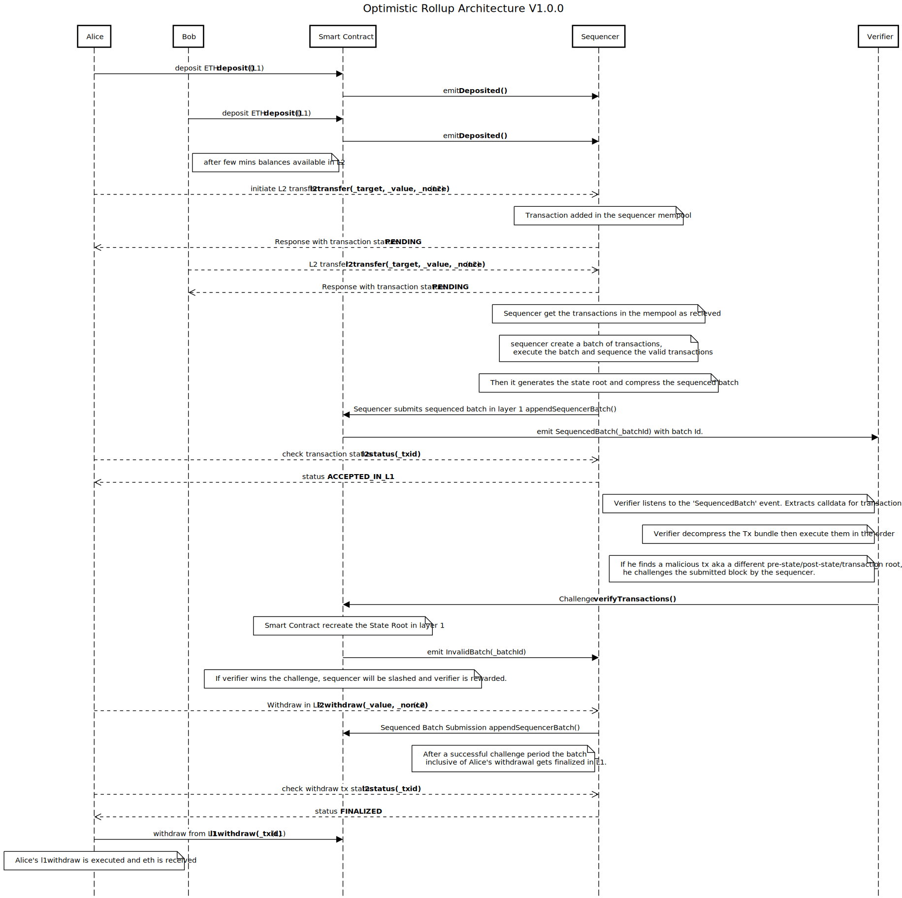

# Design and Implementation of an Optimistic Rollup System

This project demonstrates an optimistic rollup implementation.

Setup guide:

1. install packages:
go to the root directory and run.

```shell
npm install    
```
2. create a .env file according to the given sample file.

3. start a local blockchain (hardhat node)\
For Windows: open Windows Subsystem for Linux (WSL) in the the project directory and run.
```shell
npx hardhat node
```

4. deploy contracts.\
open a command prompt (cmd) a terminal (WSL) or in the project root directory.
```shell
npx hardhat run scripts/deploy.js or 
npx hardhat run scripts/deploy.js --network localhost
```
successful deployment should output follow
```shell
Compiled 7 Solidity files successfully
opr_contract deployed to 0x5FbDB2315678afecb367f032d93F642f64180aa3
```
If the contract address differs with above, change it in the .env file.

5. connect user wallet.\
In the root directory and run
```shell
npm link
opr
```
This should list down all the wallet commands (add, l1deposit etc.)

6. run sequencer.\
open a command prompt in the root directory and run
```shell
node scripts\sequencer.mjs
```

7. run verifier.\
open a command prompt in the root directory and run
```shell
node scripts\verifer.mjs
```

8. interact in the L2 by making transactions :)


### Transaction lifecycle

<!-- -->
