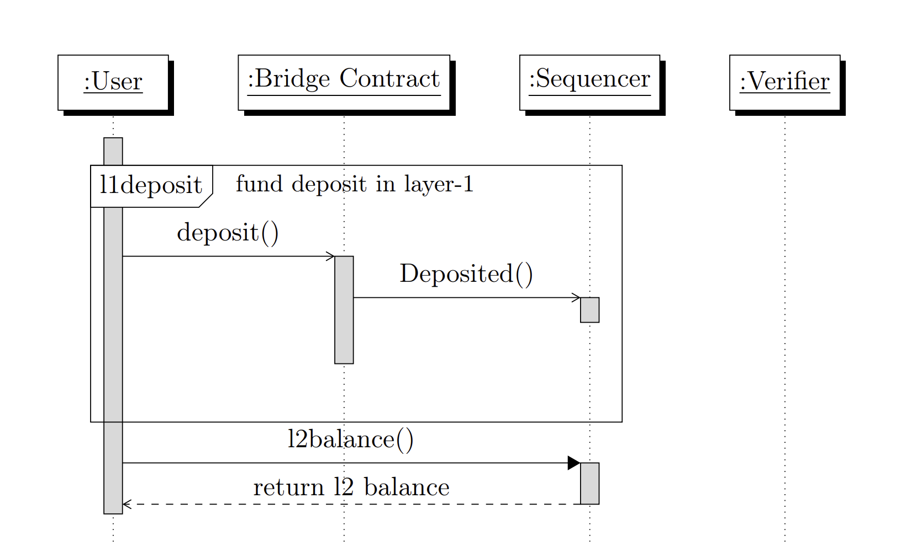

# Transactions

Transactions are cryptographically signed messages which are recorded in a blockchain.
An Ethereum transaction refers to an action initiated by an externally-owned account
(EOA). For example if Alice sends Bob 1 ETH, Alice’s account is debited and Bob’s
must be credited. This is called the “state change” in the blockchain. A transaction
carries the necessary instructions to carry out such a state change.
There are two types of accounts in Ethereum, Externally-Owned Accounts and
Contract Accounts. Externally-Owned Accounts (EOAs) are the accounts controlled
by human users through public and private keys. The public key is the identifier of
the account. Transactions are signed by the private key to prove ownership of the
EOA. An EOA can be thought of as an individual’s bank account that can be used
to send funds using password verification. Contract Accounts (CAs) are the accounts
containing code and identified by a public key. The code is commonly referred to as a
smart contract and is an automated program that runs when it receives a transaction
from another EOA or contract account.

## Transaction Types

In a blockchain there could be three ways a transaction could occur, between two
externally-owned accounts, between two contract accounts and lastly between an
EOA and a contract account. Payment transactions between users accounts are 
always between EOAs. Since our design focus only on simple payments, we captalize
on the transactions between EOAs.
Following a basic payment system, our implementation introduces three transaction
types to accomplish fund transfers between users. They are namely, deposit transactions 
(l1deposit), Layer-2 user transactions (l2transfer) and withdrawal transactions
(l1/l2withdraw). We support two Layer-1 transactions and two Layer-2 transactions
to realize above three transfer types. Layer-1 transfers consist of “l1deposit” and
“l1withdraw”, which resemble the user entry and exit of Rollup system. The Layer-2
transactions are “l2transfer” which is the user to user payment transaction in Rollup
and “l2withdraw” which allows a user to stage a Layer-2 withdraw before he withdraw
in Layer-1.

&nbsp;

    
    
<strong>The Deposit Transaction - User Entrance to the Rollup System</strong>

