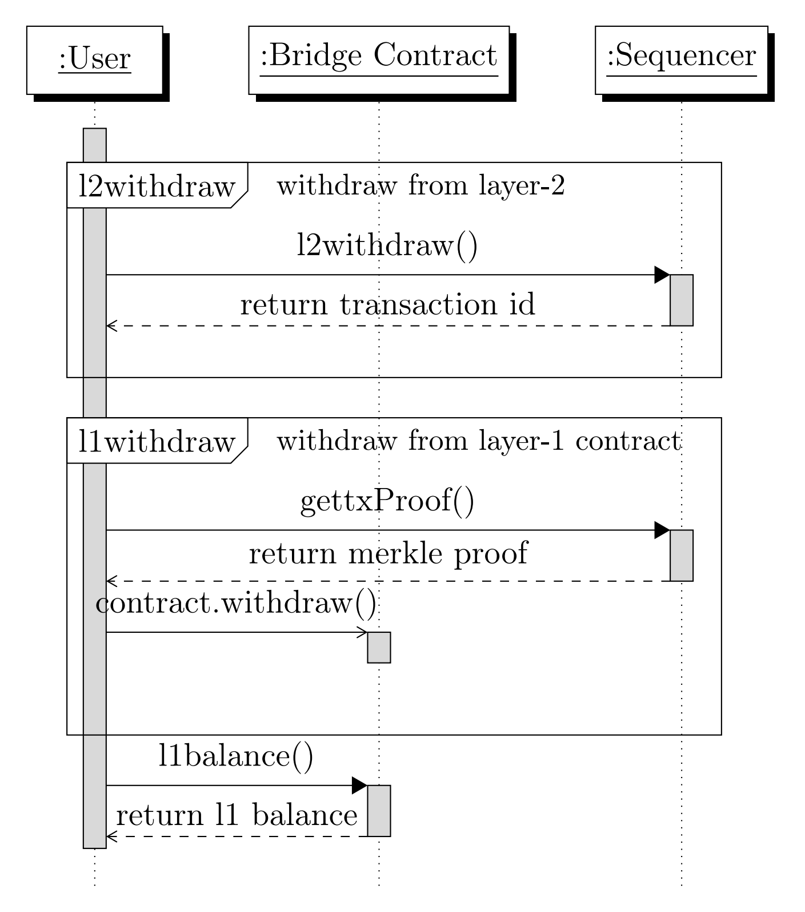

# Transactions

Transactions are cryptographically signed messages which are recorded in a blockchain.
An Ethereum transaction refers to an action initiated by an externally-owned account
(EOA). For example if Alice sends Bob 1 ETH, Alice’s account is debited and Bob’s
must be credited. This is called the “state change” in the blockchain. A transaction
carries the necessary instructions to carry out such a state change.
There are two types of accounts in Ethereum, Externally-Owned Accounts and
Contract Accounts. Externally-Owned Accounts (EOAs) are the accounts controlled
by human users through public and private keys. The public key is the identifier of
the account. Transactions are signed by the private key to prove ownership of the
EOA. An EOA can be thought of as an individual’s bank account that can be used
to send funds using password verification. Contract Accounts (CAs) are the accounts
containing code and identified by a public key. The code is commonly referred to as a
smart contract and is an automated program that runs when it receives a transaction
from another EOA or contract account.

## Transaction Types

In a blockchain there could be three ways a transaction could occur, between two
externally-owned accounts, between two contract accounts and lastly between an
EOA and a contract account. Payment transactions between users accounts are 
always between EOAs. Since our design focus only on simple payments, we captalize
on the transactions between EOAs.
Following a basic payment system, our implementation introduces three transaction
types to accomplish fund transfers between users. They are namely, deposit transactions 
(l1deposit), Layer-2 user transactions (l2transfer) and withdrawal transactions
(l1/l2withdraw). We support two Layer-1 transactions and two Layer-2 transactions
to realize above three transfer types. Layer-1 transfers consist of “l1deposit” and
“l1withdraw”, which resemble the user entry and exit of Rollup system. The Layer-2
transactions are “l2transfer” which is the user to user payment transaction in Rollup
and “l2withdraw” which allows a user to stage a Layer-2 withdraw before he withdraw
in Layer-1.

&nbsp;
&nbsp;

### Deposit Transaction - “l1deposit”

The deposit transaction is the entry point to the rollup system (See Figure 1). When a
user wants to enter the Layer-2 Rollup, he has to deposit some Ether in the Layer-1
bridge contract. Then this deposit (with a deduction for the Layer-2 costs) will be
available in the Layer-2 for use in few minutes.

The deposits are resembled in the user wallet as “l1deposit”. A deposit transfer
triggers an event in the bridge contract which then informs the sequencer on the
locked funds. Users are expected to wait until the sequencer captures the event from
the Ethereum. This delay would vary based on the mainnet congestion.

    
    
<strong>Figure 1 : The Deposit Transaction - User Entrance to the Rollup System</strong>

&nbsp;
&nbsp;

### Layer-2 User Transaction - “l2transfer”
Layer-2 user to user transfers or “l2transfer”s enable users to transfer funds without
any delays related to Layer-1 block minting and costs.
Once the transaction is initiated, the receiver will receive funds in few minutes in
Layer-2 as sequencer updates the world state of the Rollup. In general, users may
consider transaction “soft-finality” as soon as an honest sequencer submits the batch to
the Ethereum, where in which transaction status changes to “ACCEPTED_IN_L1”.
But the transaction “hard-finality” is achieved when the batch matures after the
challenge period.

&nbsp;
&nbsp;

### Withdrawal Transactions - “l2withdraw”, “l1withdraw”
The withdrawal is the most critical transaction in a Rollup design. In case of an
Optimistic Rollup, it is generally considered as a system drawback, since it takes at
least 7 days to withdraw funds back in Layer-1 securely.
Withdrawals happens in two steps in our protocol. First a user has to make an
Laye-2 withdrawal (l2withdraw) where it updates the world state on the Rollup. As
this transaction gets finalized in Layer-1, user can trigger an Layer-1 withdrawal
(l1withdraw) to secure funds in Ethereum. During an “l1withdraw”, user wallet first
requests a merkle proof from the sequencer for the initial “l2withdraw”. Then it
submit this proof to the bridge contract which validates the transaction inclusion and
eligibility.

Here we make an assumption of an honest sequencer, who will always provide
merkle proofs upon user requests. In case of a malicious sequencer who rejects to
produce proofs, users may still recreate the merkle proofs with the data available in
Layer-1. Therefore we still guarantee the safe withdrawal from the system without
any obstacles. The complete illustration of the withdrawal procedure is shown in
figure 2.
&nbsp;
&nbsp;

    
    
<strong>Figure 2 :  The Withdrawal transactions - User Exit from the Rollup</strong>

