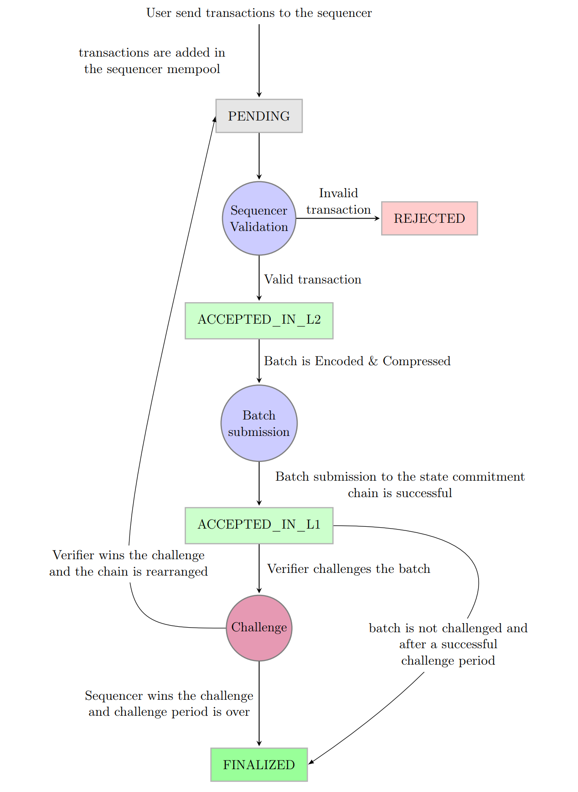

# Transaction Lifecycle

The transaction lifecyle includes the chain of states a transaction goes through
starting from its creation until finality. The complete lifecycle of a layer-2 transaction,
a **l2transfer**, is depicted in figure below.

The lifecycle starts when a user triggers a Layer-2 transaction through the wallet
which then goes to the sequencer mempool via a peer-to-peer connection. Upon
reception, sequencer creates a Layer-2 transaction with the received data and set the
status as **PENDING**.

In the second stage sequencer creates a batch of transactions and starts the
validation process. In this phase either a transaction gets **REJECTED** if it fails to
satisfy certain requirements (a valid nonce etc.) or become **ACCEPTED_IN_L2**.
Once the batch is validated, sequencer starts the post processing phase. In this
stage, the batch is encoded and compressed for better performance with respect to
the gas costs in Ethereum. If the batch gets submitted in Layer-1 successfully, all the
transactions in the batch goes to a new state **ACCEPTED_IN_L1**. This is the
“soft-finality” stage assuming an honest sequencing condition. Users are expected to
accept this soft finality under a risk of re-ordering. In case of a batch submission fail
to Layer-1, due to any network error or congestion, transactions will be re-queued
back in the sequencer queue.

Once the batch is submitted to Layer-1, verifiers are expected to validate the
submitted block within the “challenge period”. Currently, most of the available
Rollups in mainnet have set this period to 1 week (7 days).
If a verfier recognize a batch as “malicious”, he can challenge it submitting a fraud
proof. If verfier wins the challenge, state commitment chain will be “rolled back” in
Layer-1 and the batch will be re-queued back in the sequencer queue. Therefore all
transactions in this batch and all following transactions in later batches submitted in
Layer-1 will go again into **PENDING** state.
If the batch lives through the challenge period, transaction will become **FINALIZED** in Ethereum. This is the final state of a transaction reaching the irreversible
“hard-finality”. Once a transaction has achieved this state users can consume it
without any risks.

    
    
<strong>Figure 1 : The Transaction Lifecycle</strong>

