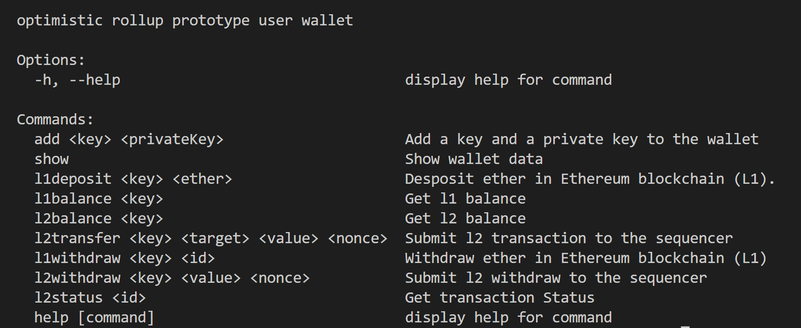

# The User Wallet
Wallets are the client-side software for decentralized applications in blockchain.
We have implemented a Command Line Interface (CLI) in Node.js for our Rollup
prototype.
Figure 1 shows the full description of the current version of the wallet. This
includes adding user data in the wallet, initiating Layer-1 deposits and withdrawals,
Layer-2 user transactions and retrieving transaction status and balance.
This wallet is a simple prototype of a cryptographic wallet. Our implementation
guarantees the user private keys are not revealed to Rollup nodes but not all security
threats are considered in this work.

    
    
<strong>Figure 1 : User Wallet CLI</strong>

## CLI Commands
Below we list down user commands of our CLI wallet.
- **add \<key\> \<privateKey\>** 

add command allows users to enter their “privateKey” 
with an identification “key” which is a unique id. The key is used
identify the account when user has multiple private keys in the wallet.
- **show** 

Shows wallet data to the user.
- **l1deposit \<key\> \<ether\>** Deposit funds in Ethereum blockchain. 
Command need two inputs “key” to identify correct private key for signing and
“ether” value.
- **l1balance \<key\>** Retrieve Layer-1 balance for the corresponding “key”.
- **l2balance \<key\>** Retrieve Layer-1 balance for the corresponding “key”.
- **l2transfer \<key\> \<target\> \<value\> \<nonce\>** Layer-2 user transactions.
Inputs are “key” identifying the user private key, “target” receiver public address,
“value” transfer amount and the correct “nonce”. It returns the transaction “id”
of the l2transfer.
- **l2withdraw \<key\> \<value\> \<nonce\>** Layer-2 withdrawal transaction.
It takes three inputs, “key”, “value” and “nonce”. It returns the transaction “id”
of the withdrawal.
- **l1withdraw \<key\> \<id\>** Layer-1 withdrawal transaction. The two inputs
are “key” and “id”, the transaction id of the corresponding l2withdraw. The
user should first initiate a l2withdraw and then wait the challenge period until
the transaction get finalized in Layer-1.
- **l2status \<id\>** Get the status of the associated Layer-2 transaction “id”.